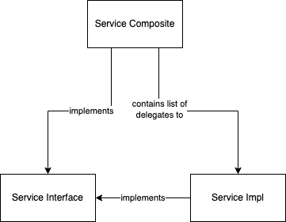

# Design Patterns - Part 2: Most Used/Useful

## Humble Object

This pattern is used when you have to interface with a very difficult-to-test and difficult-to-mock library or framework.

Humble Object is a simple thin wrapper over said library function that exposes a much better interface to your code allowing you to test-drive your
core logic in a much simpler way.

Key point of Humble Object (and why it's called "humble") is that it has the least possible amount of logic in it. Ideally, it's a simple wrapper that
transforms one interface to another, and every method of the Humble Object corresponds directly to a single un-conditional call to the library.

Here's a simple example from JS world:

You need to call `new Date()` in your code, however, you want to test-drive this behavior, and it seems like mocking `new Date()` is a nightmare, and
every time you'll have to do it, you'll have to spend too much time.

So instead, you decide to apply the Humble Object pattern and wrap all calls to `new Date()` in your system inside an object and interface that you
can control:

```typescript
export class TimeService {
  now() {
    return new Date();
  }
}
```

Now you can easily dependency-inject the time service and mock its `now()` method. Testing the Humble Object is completely optional because it's
devoid of logic, and will unlikely need to be modified, unless the standard library breaks the interface of `new Date()`, which can happen once in
5-10 years, so very rare.

## Factory

This pattern is used to abstract away the details of how a particular object or data structure is created. It's used when the complexity of creating
an object is high, and it needs to be done in multiple places. Rarely this is introduced beforehand, and is likely a result of duplication
refactoring.

Factory usually focuses on creating one type of objects. If there are many ways the object can be created, you'll have a class with multiple methods
per each standard kind of creation.

Example:

```typescript
export class ImportServiceFactory {
  createSingleSourceImportService(): ImportService {
    return new ImportServiceImpl();
  }

  createMultiSourceImportService(): ImportService {
    return new MultiSourceImport((source) => new ImportServiceImpl({source}));
  }
}
```

## Object Parent

This pattern is used to de-duplicate the creation of objects and data structures in your system. It's especially useful for the following two use
cases:

- Creation of example data structures for your tests.
- Instantiation of correct dependencies for production code and for your tests.

Object Parent is essentially a Factory on steroids. When a factory is used to create one type of objects, the object parent aims to know how to create
every object in your system that may need to be created more than a couple of times.

Having this knowledge of how to create any object in the system correctly, it has very high level of re-use and allows to always set reasonable
defaults, while providing the user chance to override these defaults when calling a factory method on the object parent.

Object parent pattern shines whenever you have to make changes to either the defaults or to how the objects need to be constructed. Instead of hunting
every single place where these objects are constructed and changing that, you can simply perform the change in a single central place.

Example for dependency management:

```typescript
export class DependencyObjectParent {
  timeService() {
    return new TimeService();
  }

  importService() {
    return new ImportServiceImpl(this.timeService());
  }
}
```

Example for data structures:

```typescript
export class DataObjectParent {
  commonDefaults = {
    email: "joe@example.org",
    password: "joessecret"
  };
  
  user({
         firstName = "Joe", 
         lastName = "Smith", 
         email = this.commonDefaults.email, 
         password = this.commonDefaults.password
  }) {
    return new User({
      firstName,
      lastName,
      account: this.account({email, password})
    });
  }

  account({email = this.commonDefaults.email, password = this.commonDefaults.password}) {
    return new Account({email, password});
  }
}
```

## Composite

This pattern is used when you have to frequently perform the same type of operation over a collection of entities
or service objects. The way it works is that you compose multiple objects that conform to the same interface
into a single object that conforms to that same interface. This way you can operate over a batch of objects as
if you were operating on a single one.

Internally, the composite usually un-conditionally delegates to all the underlying objects in a loop. Sometimes,
you can have a smarter composite which applies extra conditional logic, or serves as a Dispatcher and delegates
to only a single object according to certain criteria.

Here is a diagram:



Example:

```typescript
interface ImportService {
  executeImport(): Promise<void>;
}

class ImportServiceImpl implements ImportService {
  constructor(private source: string) {}
  
  async executeImport() {
    // executes import based on the source
  }
}

class ImportComposite implements ImportService {
  constructor(private delegates: ImportService[]) {}
  
  async executeImport() {
    for (const delegate of this.delegates) {
      await delegate.executeImport();
    }
  }
}

// somewhere in the code

const importService = new ImportComposite(
  sources.map(source => new ImportServiceImpl(source))
);

// somewhere else

await importService.executeImport();
```

## Kata

For each of the patterns above:

1. Think where you already have such a pattern in your codebase. Optionally, draw a diagram.
2. Think where you can apply this pattern, but it's currently not applied. Optionally, draw a diagram.
